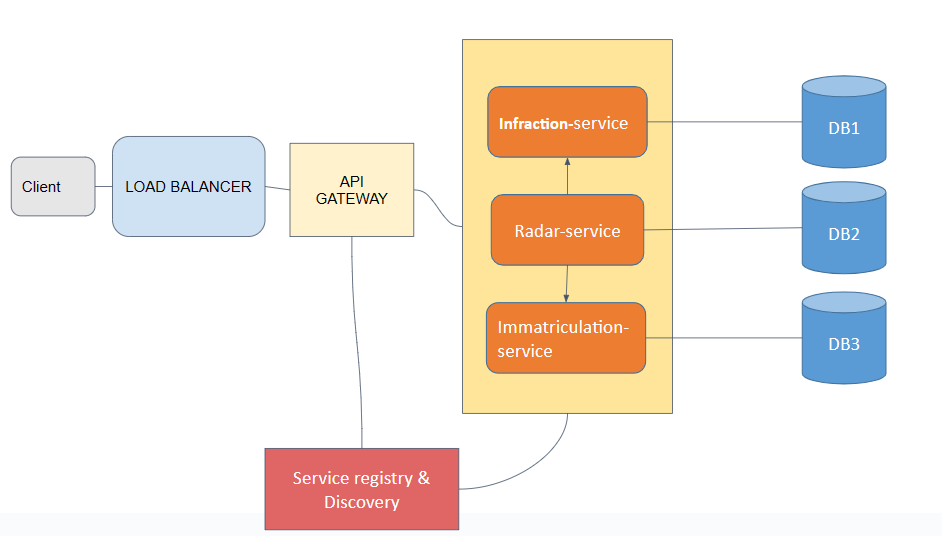
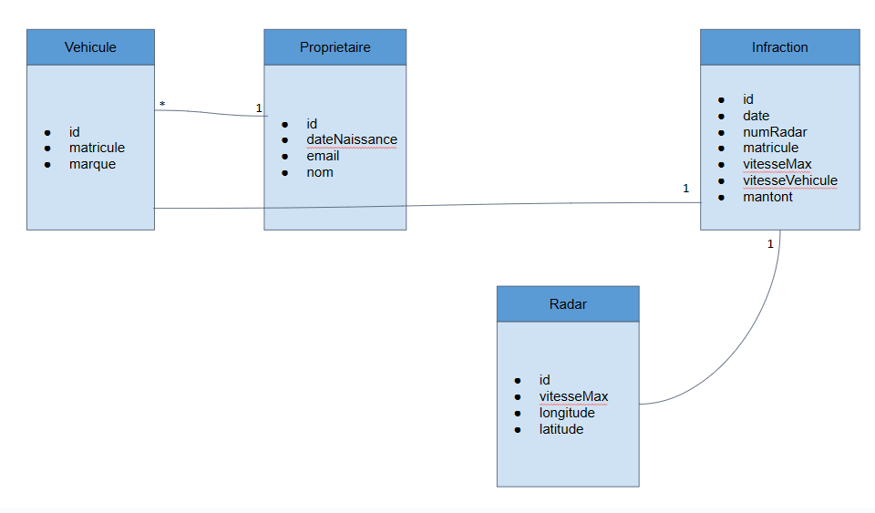
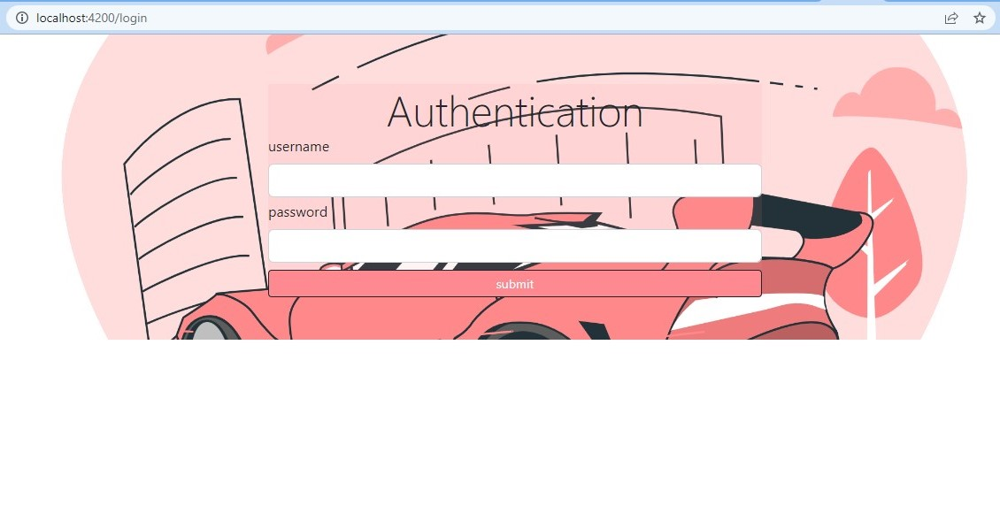
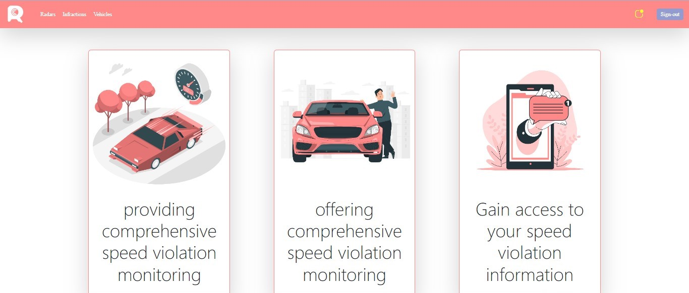
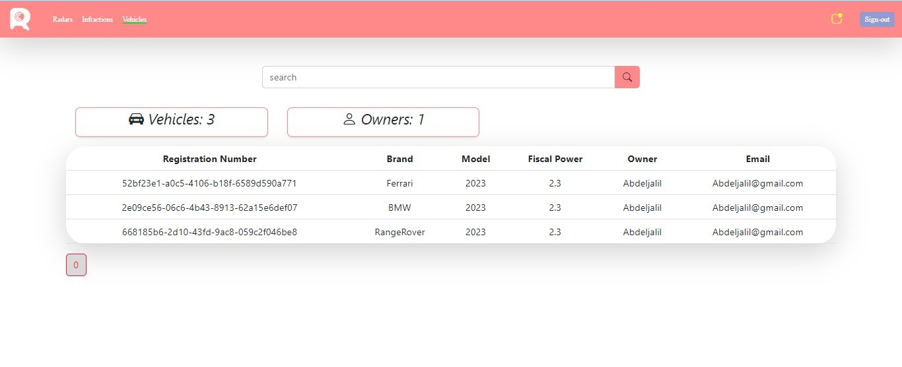
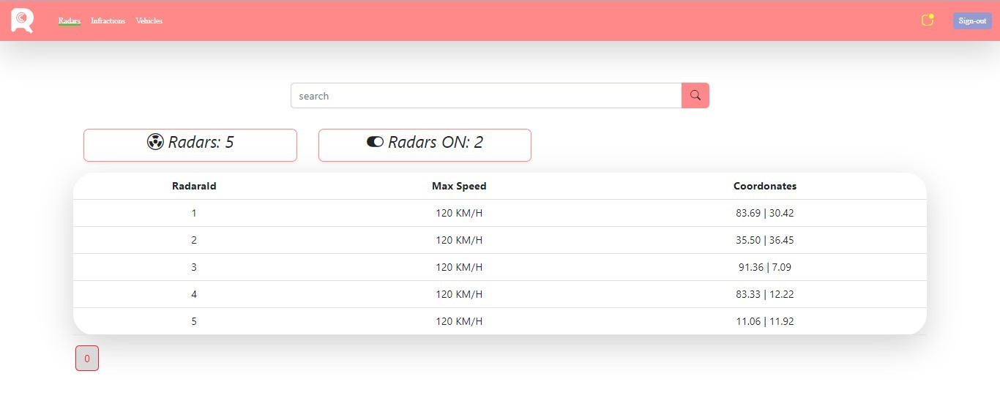
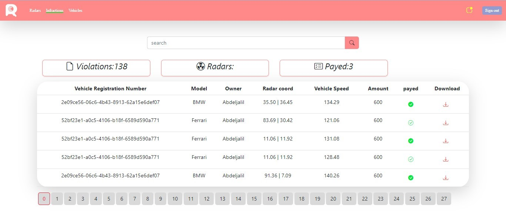

# Contrôle et Projet Programmation Distribuée

## Technologies


``` 
* Spring Cloud
* Eureka Descovery
* H2DataBase
* BloomRPC
```


## Project Structure



## Class Diagram



## ScreenShots

**Authentication Page**


**Home Page**


**Registration Page**


**Radars Page**


**Violations Page**

